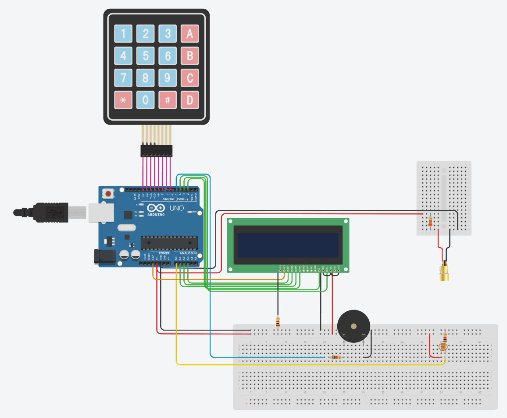

# Sistem za zaznavanje vsiljivcev - Arduino
### Samostojni projekt pri predmetu VIN

## 1. Uvod

Za samostojni projekt pri predmetu VIN sem se odločil narediti napravo, ki bo s pomočjo laserja in fotoupora zaznavala vstop vsiljivcev v sobo. Ko oseba sproži alarm, bo morala tudi vpisati geslo za deaktivacijo alarma. Če ji to ne uspe v treh poskusih bo oseba prepoznana kot vsiljivec.

Komponente, ki jih bom uporabil pri projektu:
<ul>
  <li>Arduino UNO </li>
  <li>Fotoupor </li>
  <li>Laser </li>
  <li>Brenčač </li>
  <li>4x4 tipkovnica </li>
  <li>16x2 LCD zaslon </li>
  <li>3x 1kΩ upor</li>
  <li>1x 220Ω upor</li>
</ul>

## 2. Opis posameznih komponent
### 2.1 Arduino UNO
Arduino je mikrokrmilnik na matični plošči, ki je bil zasnovan tako, da bi bil čim bolj dostopen za uporabo vsem uporabnikom. Omogoča enostavno priklapljanje in odklapljanje V/I naprav, prav tako pa nam enostaven uporabniški vmesnik Arduino omogoča programiranje, da te naprave lahko upravljamo po lastnih željah. Arduino UNO je opremljen s čipom ATmega328P. Na voljo nam je 14 digitalnih V/I priključkov (6 od teh ima možnost PWM izhoda) in 6 analognih V/I priključkov. Napajamo ga lahko z USB kablom ali z zunanjo 9-voltno baterijo (sprejema tudi napetosti med 7 in 20 volti).

### 2.2 Fotoupornik
Fotoupornik ali fotoupor je vrsta upora, katerega upornost se spreminja v odvisnosti od intenzitete svetlobe, ki pada nanj. Z naraščanjem intenzitete svetlobe upornost upornika pojema. Uporabljajo se v vezjih svetlobnih detektorjev in svetlobno občutljivih skital. Narejeni so iz polprevodnika z visoko upornostjo, ki v temi lahko dosega do več megaohmov, na svetlobi pa ta upornost pade tudi na nekaj sto ohmov.

### 2.3 Laser
Ime laser izhaja iz angleškega akronima LASER (Light Amplification by Stimulated Emission of Radiation). To je naprava, ki za vir energije uporablja pojav stimuliranega sevanja (emisije) in ojačanja svetlobnega sevanja.

### 2.4 Brenčač
Je majhen zvočnik, ki oddaja poljubne frekvence zvoka. Je zelo enostaven za priklop, uporablja se ga lahko za "predvajanje pesmi", alarme, opozorila, na splošno zvočne signale...

### 2.5 4x4 Tipkovnica
Je tipkovnica s 16 tipkami, ki jih lahko v programu poljubno uporabljamo. Za priklop potrebujemo 8 prostih priključkov (4 vrstice in 4 stolpci). Glede na to katera vrstica in stolpec sta aktivna določimo katera tipka je trenutno pritisnjena na tipkovnici.

### 2.6 16x2 LCD zaslon
Je majhen zaslon, ki omogoča prikaz 16 znakov v dveh vrsticah. Ima 16 priključkov, a za osnovno delovanje ne potrebujemo vseh:
<ul>
  <li>GND - Ozemljitev</li>
  <li>VCC - Povezava na 5V </li>
  <li>V0 - Pin za kontrast (0V) - maksimalen kontrast, (5V) - minimalen kontrast </li>
  <li>RS - "Register Select", 0: Ukazni register, 1: Podatkovni register</li>
  <li>R/W - "Read Write", 0: Write mode, 1: read mode</li>
  <li>E - "Enable" pin za vključitev LCD </li>
  <li>7-14 Data Pins - LCD podatkovno vodilo. Uporabljajo se za paralelni prenos podatkov</li>
  <li>A - Anoda za osvetlitev odzadja (3.3V)</li>
  <li>C - Katoda za osvetlitev odzadja (GND)</li>
</ul>

## 3. Shema vezja: 

Za najboljšo vidljivost sem shemo kar narisal v AUTODESK Tinkercadu. Na shemi so vse že prej naštete kompotente povezane na Arduino. Pomembno je, da je laser usmerjen v fotoupor kot na shemi, fizična postavitev drugih komponent pa ni pomembna.

## 4. Video demonstracija: 

Za konec sem posnel še video demonstracijo delovanja moje naprave. Med laser in fotoupor sem postavil oviro, ki jo je sistem zaznal. Nato sem vpisal že prej nastavljeno kodo 1234 in alarm se je resetiral v aktivno stanje. Ko sem ga naslednjič sprožil, sem demonstriral še neuspešno vnašanje kode.

